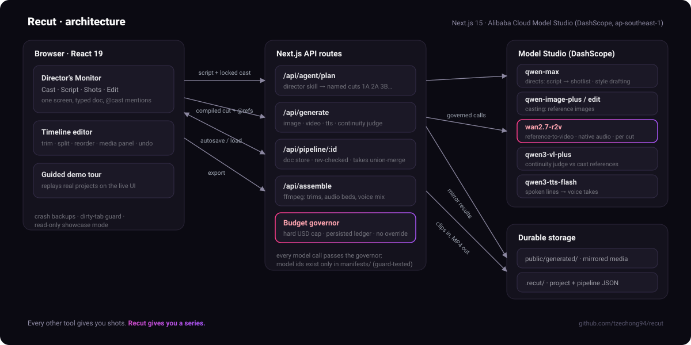

# Recut: AI Showrunner

**Every other tool gives you shots. Recut gives you a series.**

Recut is an AI showrunner for short films and ads. You cast characters once as
locked reference images, paste a script, and a director agent breaks it into
named cuts with blocking and camera presets. Each cut is generated by a
reference-to-video model with the cast bound by name, so the same characters
come back in every shot, through every frame, with native audio. Keepers land
on a real timeline (trim, split, reorder), and ffmpeg renders the final film
with every clip's own audio bed and voice lines mixed in.

Built for the Qwen Cloud Global AI Hackathon, Track 2 (AI Showrunner), on
Alibaba Cloud Model Studio.

## Try it in 60 seconds

```
pnpm install
cp .env.example .env.local   # add your DashScope key for live generation
pnpm dev                     # open http://localhost:4800
```

Open **/demo** and pick a film: a guided tour replays a real project through
the actual product UI, step by step, using that project's pre-generated media.
No API key needed, zero spend.

## The system at a glance



Cast locks references, the director skill writes named cuts, each cut goes to
reference-to-video with the cast bound by name, keepers land on the timeline,
and ffmpeg renders the film. Every model call passes the budget governor and
every result is mirrored to durable storage on arrival. Key-decision notes are
in [docs/ARCHITECTURE.md](docs/ARCHITECTURE.md).

## How it works, stage by stage

### 1. Cast

Describe a character, prop, or location; Recut batch-generates candidates with
qwen-image-plus (or edits from an uploaded photo with qwen-image-edit). You
crown a winner and **lock** it. Locking matters: only locked assets can be
referenced by shots, and the casting prompt is stored on the asset as
provenance. From then on the asset travels by `@slug` (e.g. `@yeepi`): every
cut that mentions it gets the reference image attached automatically.

### 2. Script

Paste a full script or a two-line premise. The director skill (qwen-max with a
film-directing system prompt) breaks it into scenes and named cuts: `1A`, `2A`,
`3B`, each with blocking, acting beats, a spoken line when the story needs one,
and camera presets (shot size, angle, lens, light) as structured fields, not
prose. The skill **respects the author**: registered cast names are used
verbatim, and authored style blocks pass through word for word. A lockable
Global Style is glued to every cut so the film holds one look.

### 3. Shots

Each cut compiles to a typed prompt: global style, the cut's text, camera
presets, then enumerated reference bindings ("Reference image 1 is yeepi
(character)… never merge, swap, or average their features"). That compiled
prompt plus the locked reference images goes directly to **wan2.7-r2v**,
Wan's reference-to-video model, which returns motion and native audio in one
generation. There is no keyframe step: identity is enforced across every frame
by the references, not just frame one. Takes land in a compare grid; you star
a keeper per cut. A continuity judge (qwen3-vl-plus) can score any take
against the cast references. Spoken lines become voice takes via qwen3-tts.

### 4. Edit

Keepers form a real timeline: click to seek, space to play, S to split at the
playhead, drag clip edges to trim, drag alternates in from the media panel,
undo 50 levels deep, scroll to zoom. Export runs ffmpeg server-side: per-clip
trims, your order, each clip's native audio bed with edge fades, TTS voice
lines mixed over, and an MP4 auto-downloads. Export never mutates the edit.

## Why reference-to-video, not image-to-video

Our first build was a node canvas around the image-to-video pattern: generate
a still, judge it, animate it. It looks cheaper (a cheap image gates every
expensive clip), but it only guarantees the first frame. The moment a shot
moves, identity drifts, and you pay for the repair: re-rolls, fixes,
re-animation. Binding locked references directly into the video model gives
consistency by construction, one generation per cut, sound included. The old
canvas still lives on the `main` history; the pivot is the product.

## Models (Alibaba Cloud Model Studio / DashScope, ap-southeast-1)

| Role | Model |
|---|---|
| Director / planning / style drafting | qwen-max |
| Cast image generation / edit | qwen-image-plus / qwen-image-edit |
| Continuity judge | qwen3-vl-plus |
| Video generation (reference-to-video) | wan2.7-r2v |
| Image-to-video (legacy path) | wan2.6-i2v |
| Dialogue TTS | qwen3-tts-flash |

## Engineering decisions

- **Model ids live only in `manifests/`.** A guard test fails if a model id
  string appears anywhere else. A new provider is one manifest plus one
  serializer; the router picks it up with zero other changes.
- **Prompts are compiled, never concatenated in components.** Style, cut text,
  camera presets, and reference bindings are typed fields assembled by a pure
  function (`lib/pipeline/doc.ts`), so switching models can never degrade a
  prompt.
- **Hard budget governor.** Live mode requires `RECUT_BUDGET_USD`; the
  submitter refuses any job that would cross the cap, spend is persisted
  across restarts, and the ledger is always visible in the app header.
- **Durability.** Hosted DashScope result URLs expire in about a day, so every
  image, clip, and voice line is mirrored into `public/generated/` the moment
  it is produced, and reference images are re-uploaded through DashScope's
  file API at generation time so the model can always fetch them.
- **Crash safety.** Saves retry and surface failures; the server rejects
  stale-revision writes and union-merges takes (the expensive artifacts are
  never lost); a localStorage backup restores unsaved work after a crash.
- **Read-only showcase.** `RECUT_SHOWCASE_IDS` locks listed projects on a
  deployed instance: judges can explore and even edit in-session, but nothing
  persists and the server rejects writes.
- **The demo is the product.** `/demo` replays real projects through the live
  UI with coach-mark popups: prompts type themselves into the real inputs and
  the project's actual media reveals in place. Demo mode never saves.

## Verify

```
pnpm typecheck && pnpm test && pnpm build   # types, units (incl. manifest guard), build
pnpm test:e2e                               # Playwright: full product flow + demo tour
```

## Repository layout

```
app/                Next.js 15 App Router: pages + API routes (generate, agent, assemble, pipeline)
components/pipeline/  Director's Monitor, stages, timeline editor, demo Tour
lib/pipeline/       PURE document model + compile helpers, zustand store
lib/server/         file-backed project + pipeline stores (rev-checked saves)
lib/agent/          director skill prompt + plan parsing
adapters/           DashScope HTTP adapters (text, image, video, upload)
manifests/          the ONLY place model ids may appear (guard-tested)
lib/post/           ffmpeg assembly (trims, audio beds, voice mix)
fixtures/demo-projects/  canonical demo project snapshots (deployment seed)
docs/               architecture, product north star, pipeline spec, submission kit
blog/               build-story post (GitHub Pages ready)
```

## Docs

- [docs/ARCHITECTURE.md](docs/ARCHITECTURE.md): component diagram + key decisions
- [docs/PRODUCT.md](docs/PRODUCT.md): product north star
- [docs/PIPELINE-SPEC.md](docs/PIPELINE-SPEC.md): the three-stage pipeline spec
- [docs/SUBMISSION.md](docs/SUBMISSION.md): hackathon submission kit
- [blog/index.html](blog/index.html): how we built it (and why we changed direction)
