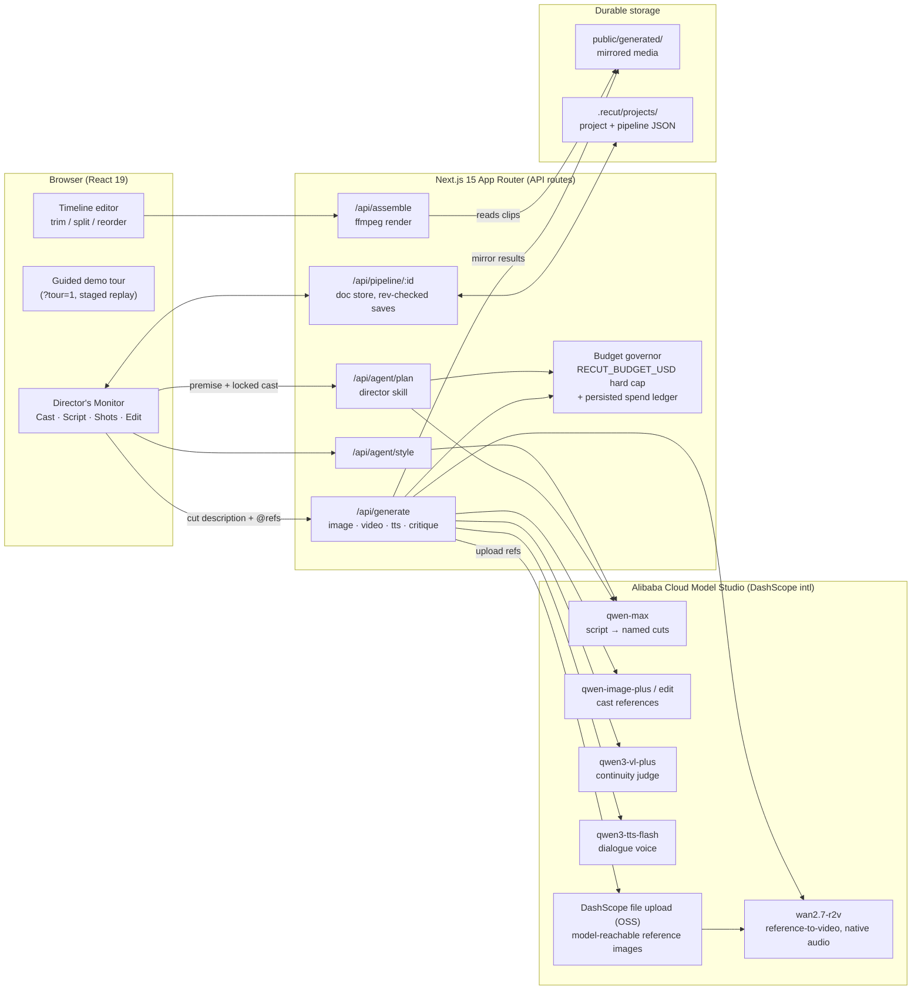

# Architecture

Recut is a Next.js 15 app whose API routes orchestrate Alibaba Cloud Model
Studio (DashScope, ap-southeast-1) models behind a manifest/adapter gateway.
All generated media is mirrored to durable local storage the moment it is
produced, because hosted result URLs expire.

## Key decisions

- **Reference-to-video, not image-to-video.** Image-to-video only guarantees
  the first frame; identity drifts as soon as the shot moves. Binding locked
  cast references directly into wan2.7-r2v holds identity through every frame
  and returns motion plus native audio in one generation per cut.
- **Model ids only in `manifests/`.** A guard test fails the build if a model
  id string appears anywhere else. Adding a provider is one manifest plus one
  serializer; the router picks it up with no other changes.
- **Typed prompt compilation.** A cut's prompt is compiled from typed state
  (style prefix, cut text, camera presets, enumerated reference bindings that
  forbid merging distinct characters), never concatenated in components.
- **Budget governor.** Live mode requires a hard USD cap; the submitter refuses
  any job that would cross it and the ledger survives restarts.
- **Durability.** Hosted DashScope result URLs expire in about a day, so every
  image, clip, and voice line is mirrored into `public/generated/` at creation,
  and reference images are re-uploaded through DashScope's file API at
  generation time so the model can always fetch them.
- **Crash safety.** Saves retry and surface failures; the server rejects stale
  writes by revision and union-merges takes; a localStorage backup restores
  unsaved work; demo mode never persists.
